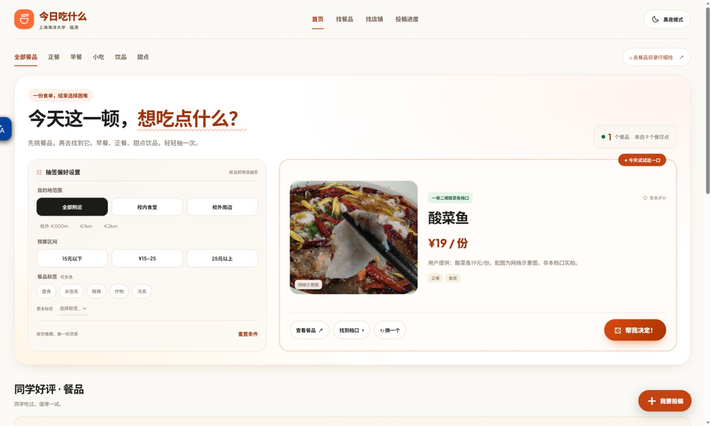

# 🍜 今日海大吃什么

**从「随便吃点」到「就吃这家」。** 
上海海洋大学同学一起维护的校园与周边餐饮指南。

[找餐品](https://eat.shoumc.com/foods/) · [逛店铺](https://eat.shoumc.com/restaurants/) · [分享推荐](https://eat.shoumc.com/submit/)

截图中的酸菜鱼为网络示意图：[Pauloleong2002 / Wikimedia Commons](https://commons.wikimedia.org/wiki/File:%E9%85%B8%E8%8F%9C%E9%AD%9A.jpg)，[CC BY-SA 4.0](https://creativecommons.org/licenses/by-sa/4.0/)，经转码与页面裁切显示。

## 今天这一顿，这里帮你选

- **纠结时，抽一个。** 按口味、预算与距离缩小范围，把选择交给随机推荐。
- **想好再出发。** 搜索餐品和店铺，看看位置、价格、照片与同学留下的评价。
- **好吃的，一起记下来。** 分享餐品、店铺或真实体验；照片选填，审核通过后公开。
- **白天夜里，都好逛。** 明暗主题随心切换，拖动悬浮投稿按钮，把它放在顺手的位置。

这里记录的是同学的真实分享。口味因人而异，价格与营业信息请以现场为准；没有核实的信息会保留未知，不用猜测填满空白。

## 一起把海大的饭搭子地图补全

发现宝藏店铺？[来投稿](https://eat.shoumc.com/submit/)。发现功能问题或有新点子？[告诉我们](https://github.com/Conduit-Club/what-to-eat-in-shou-today-done-right/issues)。

开发与维护说明见 [AGENTS.md](AGENTS.md)。

## 来源与许可

内容按条目保留来源、署名与授权。旧站资料保留 **CC BY-NC-SA 4.0** 声明，SHOU-Online-Manual 资料保留 **CC BY-SA 4.0** 声明；不同来源分别遵循原许可。图片与投稿的授权以各条目为准。
